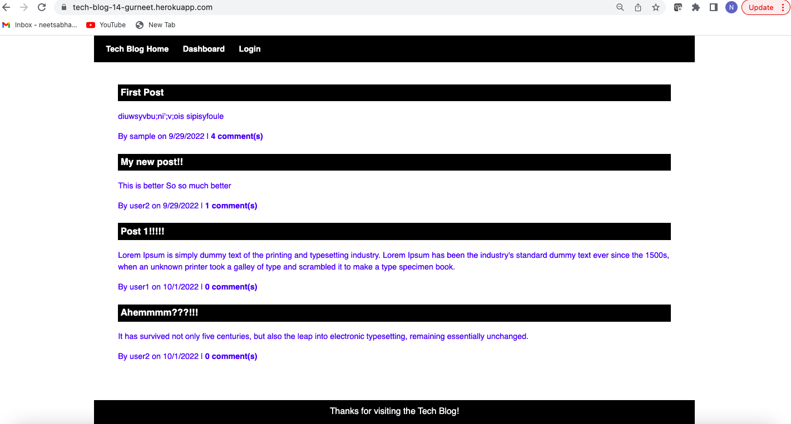

# Tech Blog

A CMS-style blog site where developers can publish their blog posts and comment on other developers’ posts as well.

  ## Licensing:
  

  ## Table of Contents 
  - [Description](#description)
  - [Screenshot](#screenshot)
  - [Installation](#installation)
  - [Contribution](#contribution)
  - [Testing](#testing)
  - [Additional Info](#additional-info)

  ## Description:
   A CMS-style blog site where developers can publish their blog posts and comment on other developers’ posts as well. Follows the MVC paradigm in its architectural structure, using Handlebars.js as the templating language, Sequelize as the ORM, and the express-session npm package for authentication.
  
  ## Screenshot:
  
  
  ## Installation:
  App uses NODE.JS, EXPRESS.JS, MYSQL, Sequelize ORM, BCrypt, Connect Session Sequelize or just do 'npm i' through the command line to install the necessary packages.
  
  Also deployed to Heroku: https://tech-blog-14-gurneet.herokuapp.com/

  ## Contribution:
  No contributions please.

  ## Testing:
  Tested thoroughly in develompment environment.
  
  ## Additional Info:
  - Github: [neetsabharwal](https://github.com/neetsabharwal)
